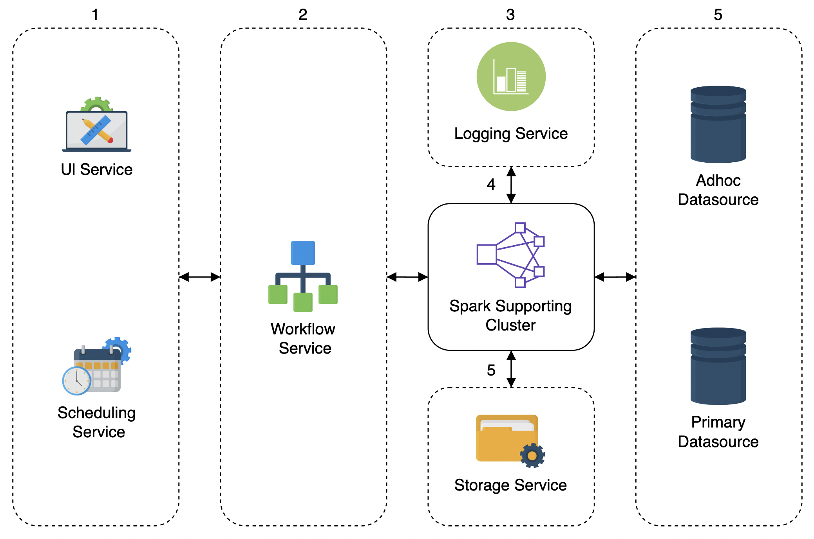
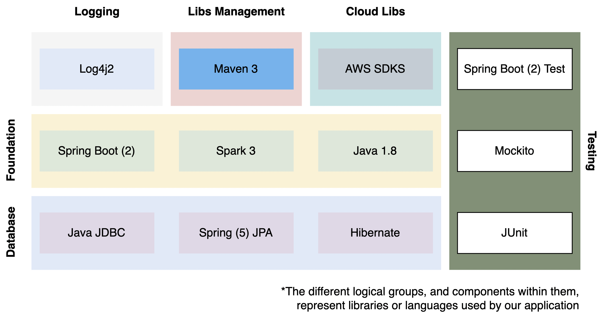
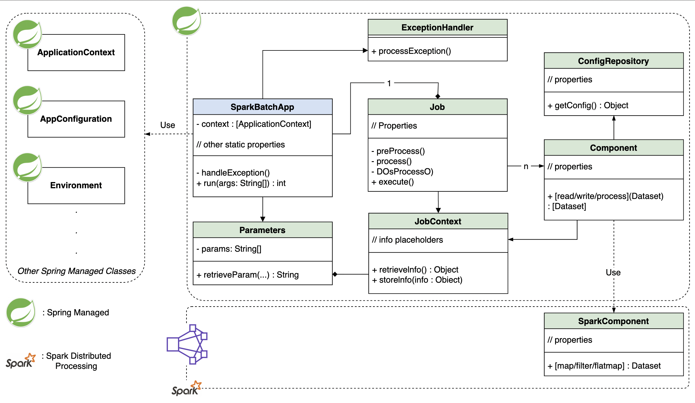
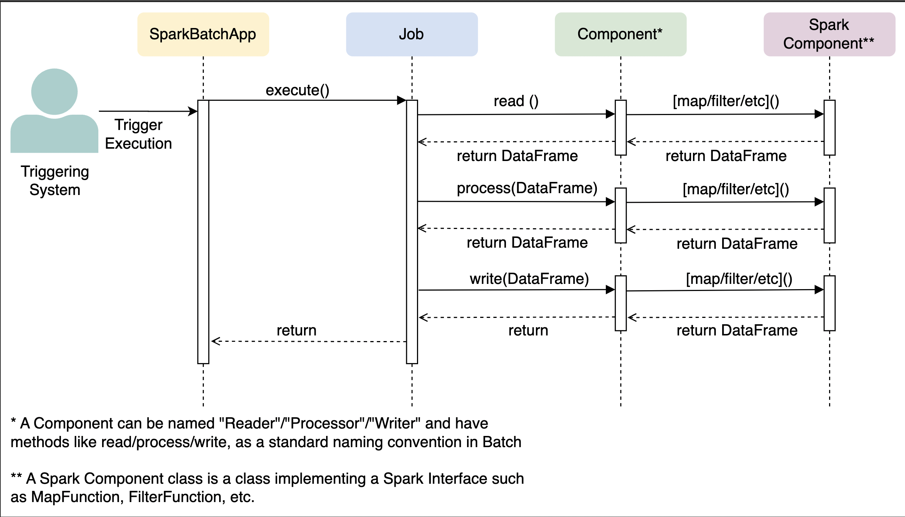
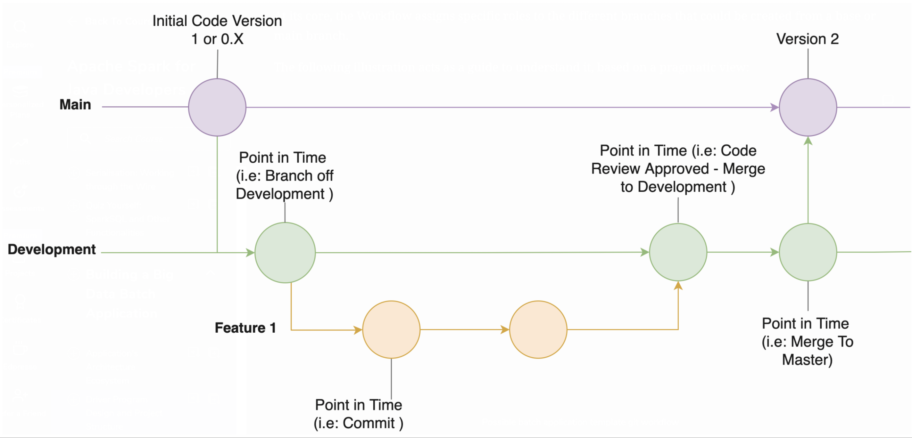
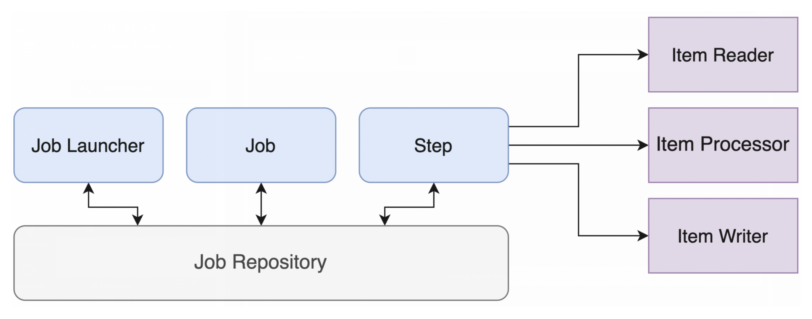

## Architecture

## Driver program design

### Required functionalities

- All types of application configurations.
- Validations.
- Parsing of input parameters (jobs’ arguments).
- Error handling.
- Application components bootstrapping.
- Creation and coordination of the parts of the application running distributedly in the worker nodes (the classes implementing the Spark API that contains the main logic of the batch jobs).

### Technology stack

### UML Class diagram

### UML Sequence diagram

## Version control flow and Project structure

### Version control flow

### Project structure

| Package       |  Description  |
|---------------|:-------------:|
| configuration | left-aligned  |
| exception     |   centered    |  
| job           | right-aligned |   
| job.component | right-aligned |   
| parameter     | right-aligned |   
| resources     | right-aligned |   
| persistence   | right-aligned |   

## Concrete Job Implementation and Batch pipelines

## Compilation and Execution

This is a *Maven 3.X* project, so the following commands are relevant:

- To compile:

  `mvn clean package spring-boot:repackage`

- Once the application *jar* file is created, the program can be executed by running:

  `java -jar spark-etl-boilerplate-1.0-SNAPSHOT.jar jobName=[jobName] [parameters]`

  Where the jar name can be configured or changed in the `pom.xml` file.

- There is a Dummy Job that runs the application beginning to end, to do so, compile as described above and run:

  `java -jar spark-etl-boilerplate-1.0-SNAPSHOT.jar` jobName=sparkJob

